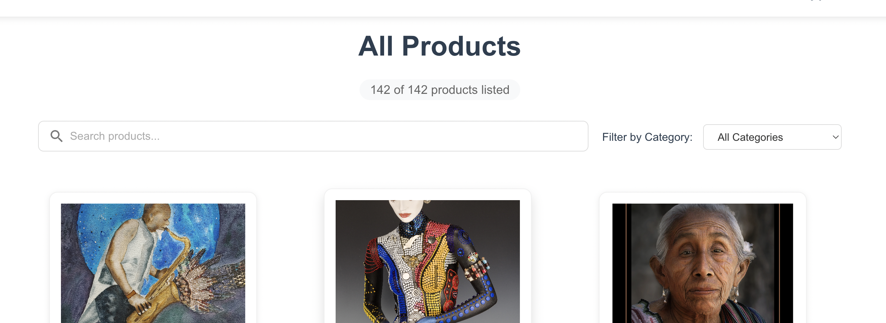

# Jotform Frontend Hackathon Projesi

## Kullanıcı Bilgileri

-   **İsim**: Mert Çetin

## Proje Açıklaması

Bu proje, Jotform Frontend Hackathon için geliştirilmiş bir e-ticaret web uygulamasıdır. Jotform API'leri ile entegre çalışarak ürün bilgilerini çeker ve ödeme işlemlerini gerçekleştirir. Ürün listeleme, alışveriş sepeti işlevselliği ve ödeme süreci içeren duyarlı bir kullanıcı arayüzüne sahiptir.

## Temel Özellikler

-   Görsellerle, açıklamalarla ve fiyatlandırma ile ürün gösterimi
-   Ekleme/çıkarma işlevselliğine sahip alışveriş sepeti
-   Mobil ve masaüstü için duyarlı tasarım
-   Redux ile durum yönetimi
-   Her ürün için benzer ürün önerileri
-   Sepette gerçek zamanlı toplam fiyat hesaplaması
-   Kategori bazlı filtreleme ve arama özelliği
-   Jotform form verilerine göre dinamik sayfa başlığı

## Dinamik Sayfa Başlığı

Uygulama, Jotform'dan alınan form verilerine göre sayfa başlığını otomatik olarak günceller. Bu sayede farklı form ID'leri kullanıldığında, o forma ait başlık sayfada görüntülenir.


## Arama ve Filtreleme Özellikleri

Kullanıcılar, ürünler sayfasında ürünleri kategoriye göre filtreleyebilir veya arama çubuğunu kullanarak belirli ürünleri arayabilirler. Bu özellik, kullanıcıların istedikleri ürünleri hızlıca bulmalarını sağlar.



## Benzer Ürünler Özelliği

Ürün detay modalında, seçilen ürüne benzer ürünler listelenmektedir. Bu özellik kullanıcıların ilgilenebilecekleri diğer ürünleri keşfetmelerine yardımcı olur.


## Dinamik Toplam Fiyat Hesaplaması

Alışveriş sepetindeki ürünlerin miktarı değiştiğinde toplam fiyat otomatik olarak güncellenir. Bu sayede kullanıcılar her zaman güncel toplam tutarı görebilirler.


## Form ID Varyasyonları

Uygulama, kullanılan form ID'sine göre modal tasarımını dinamik olarak değiştirir:

### Form ID Değiştirme

Form ID'niz App.js dosyasında manuel olarak değiştirilmelidir:


### Form ID 2 Modal Tasarımı


### Form ID 3 Modal Tasarımı


Farklı tasarımları görmek için App.js dosyasındaki form ID'sini değiştirebilirsiniz:

```javascript
// Kullanılabilir form ID'leri: FORM_ID_1, FORM_ID_2, FORM_ID_3
const selectedFORM_ID = FORM_ID_3; // İstediğiniz form ID'sine değiştirin
```

## Kullanılan Teknolojiler

-   React 19
-   Navigasyon için React Router
-   Durum yönetimi için Redux
-   Material UI bileşenleri
-   Jotform API entegrasyonu

## Başlangıç

Projeyi yerel olarak çalıştırmak için:

1. Depoyu klonlayın
2. Proje dizinine gidin:
    ```
    cd frontend_jotform
    ```
3. Bağımlılıkları yükleyin:
    ```
    npm install
    ```
4. Geliştirme sunucusunu başlatın:
    ```
    npm start
    ```
5. Tarayıcınızı açın ve http://localhost:3000 adresine gidin

## Lisans

Bu proje MIT Lisansı altında lisanslanmıştır - detaylar için [LICENSE](LICENSE) dosyasına bakın.
